# FitQuest

FitQuest is a full-stack AI-powered fitness platform that helps users achieve their fitness goals through personalized workout and diet plans, expert consultations, community engagement, and an integrated fitness marketplace.

## ✨ Features

- 🤖 AI-generated workout and diet plans using Gemini API
- 🔐 Secure user authentication & authorization
- 🛍️ Fitness product marketplace with shopping cart
- 💳 Secure checkout using eSewa
- 📦 Order history and purchase management
- 👨‍⚕️ Browse fitness experts and book available time slots
- 💬 Community platform with posts, likes, and comments
- 📱 Responsive and user-friendly interface

## 🛠️ Tech Stack

### 🎨 Frontend

- React.js
- HTML5
- CSS3
- JavaScript

### ⚙️ Backend

- Node.js
- Express.js

### 🗄️ Database

- MongoDB
- Mongoose

### 🤖 AI

- Gemini API

### 🔧 Tools & Libraries

- JWT (JSON Web Token)
- bcrypt.js
- Cloudinary
- Multer
- Nodemailer
- eSewa Payment Gateway

## 📸 Screenshots

<table>
  <tr>
    <td align="center">
      <strong>🔐 Authentication </strong>  
      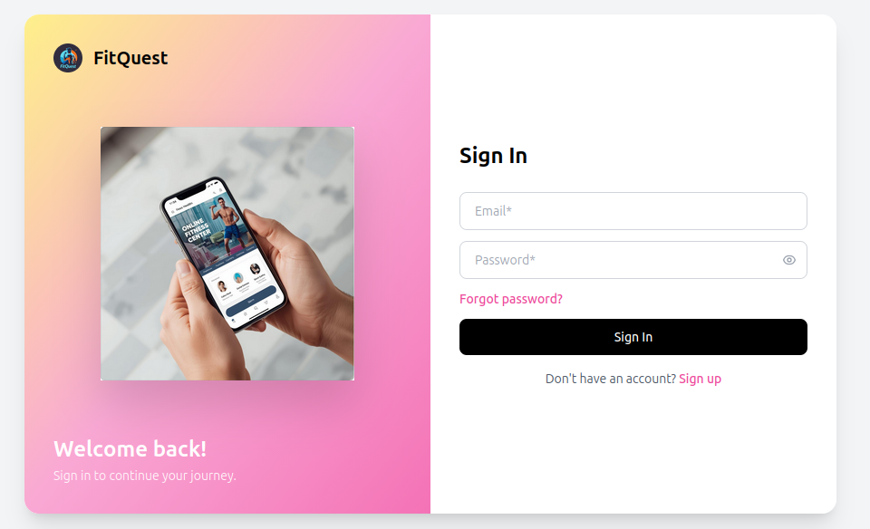
      
      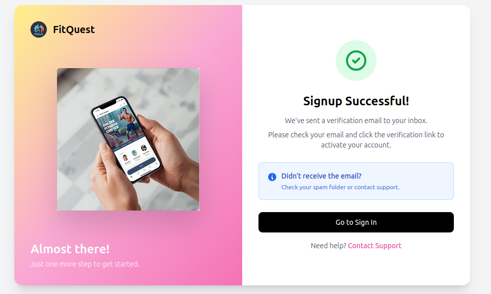
      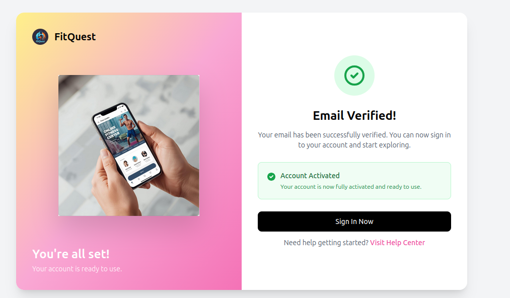
    </td>
    <td align="center">
      <strong>🏠 Homepage</strong>  
      
    </td>
  </tr>

  <tr>
    <td align="center">
      <strong>🤖 Fitness plan</strong>  
      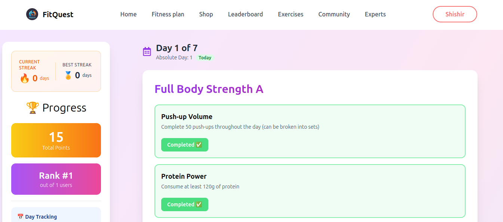
      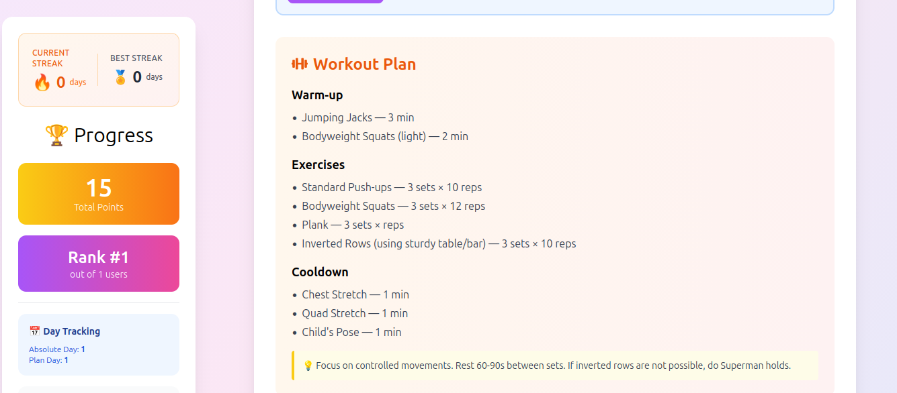
      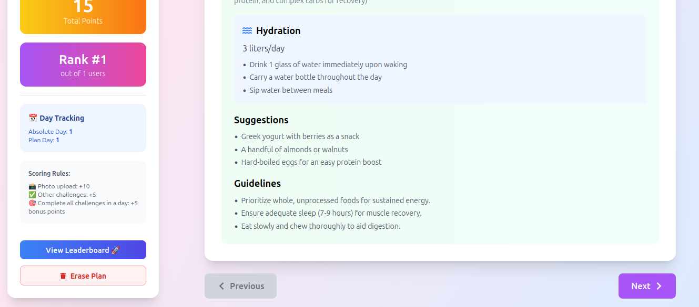
    </td>
  </tr>

  <tr>
    <td align="center">
      <strong>👨‍⚕️ Shopping</strong>  
      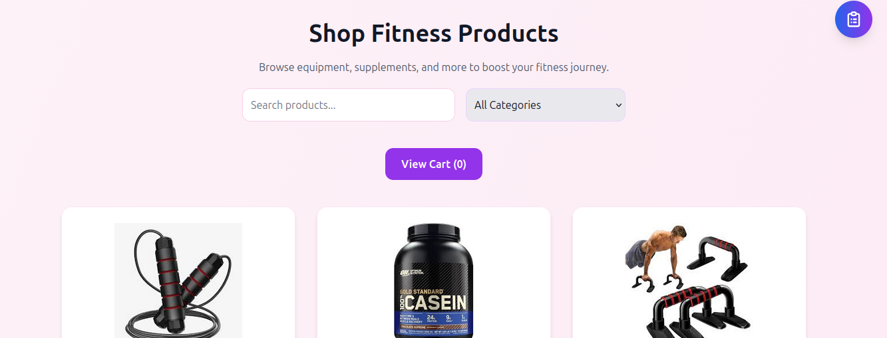
      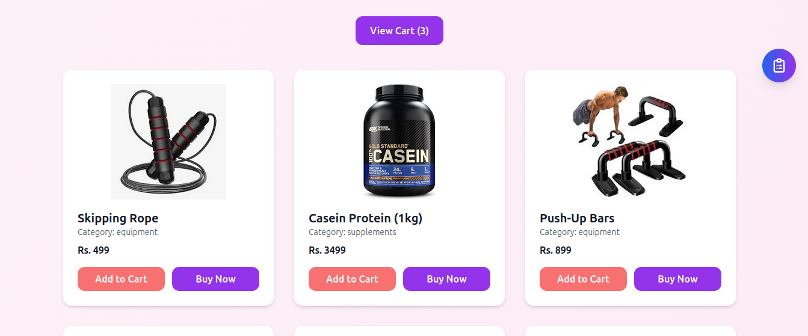
      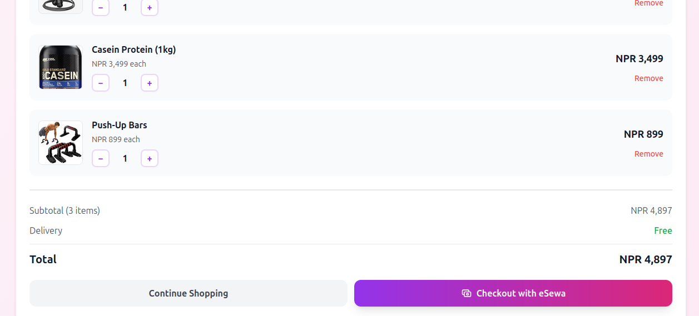
    </td>
  </tr>

  <tr>
    <td align="center">
      <strong>💳 eSewa Payment</strong>  
      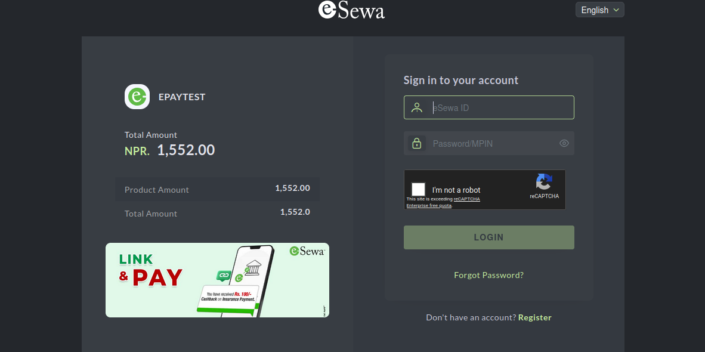
      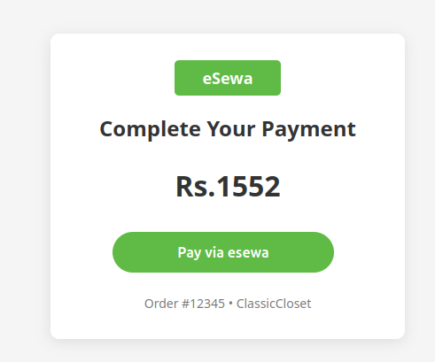
      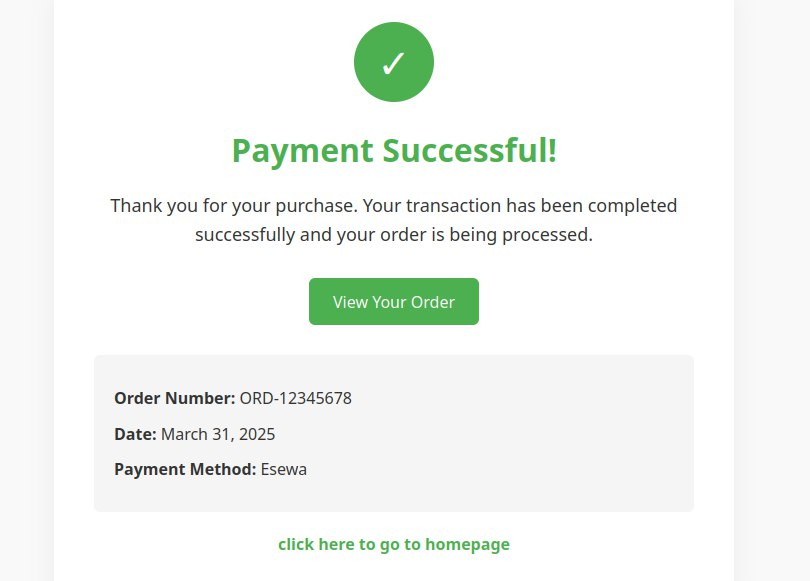
    </td>

  </tr>

  <tr>
    <td align="center">
      <strong>🛒 Experts booking</strong>  
      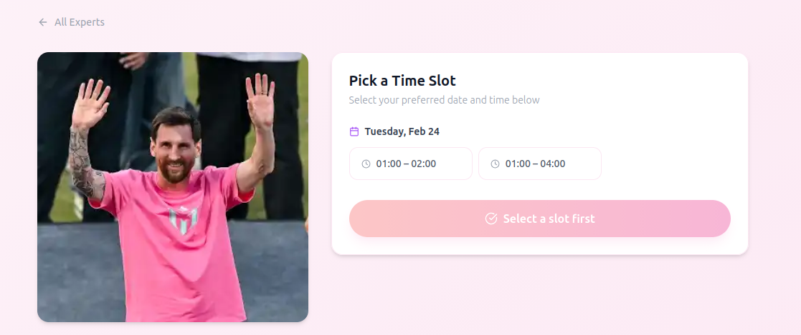
      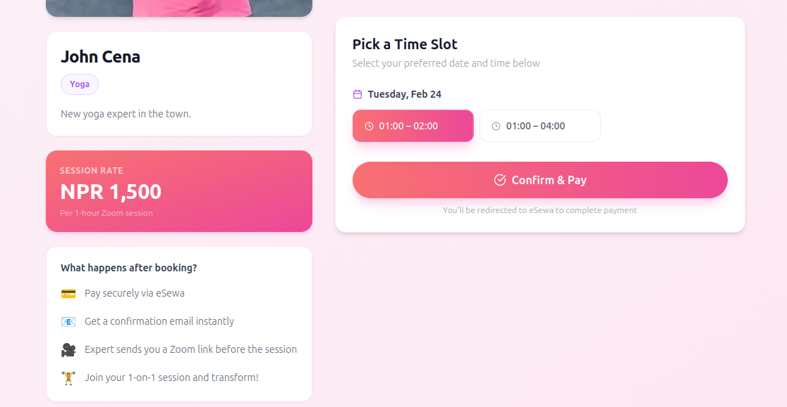
    </td>
  </tr>

  <tr>
    <td align="center">
      <strong>💬 Community Feed</strong>  
      
      
       
    </td>
  </tr>

  <tr>
    <td colspan="2" align="center">
      <strong> Leaderboard</strong>  
      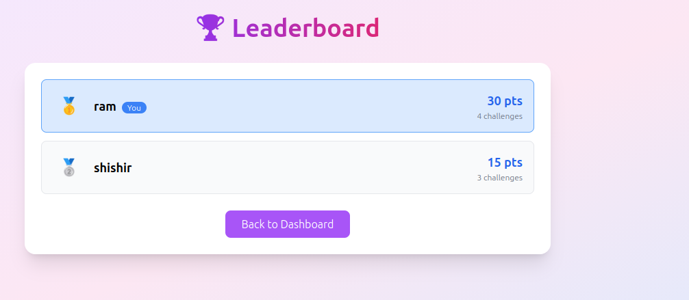
    </td>
  </tr>
</table>
